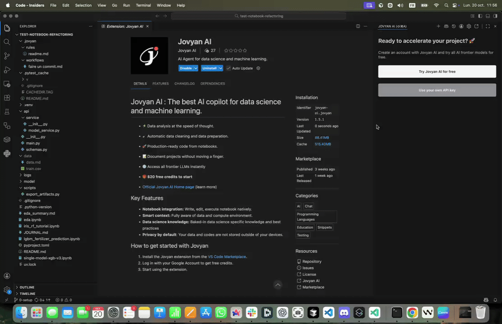
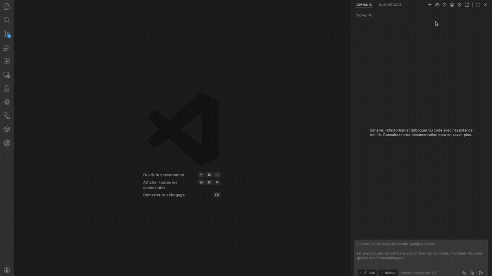

# Create Your Account

Jovyan AI offers multiple ways to access AI models. Choose the option that works best for you.

## Option 1: Jovyan AI Account (Recommended)

The easiest way to get started. Sign up for a Jovyan AI account to access all major models without managing API keys.

### Benefits

- **No API key setup required** - Start immediately
- **Access to all major models** - GPT, Claude, Gemini, and more
- **30-day free trial** - Full access to Pro plan, no credit card required
- **Flexible subscription plans** - Starting at $20/month

### Registration Process

1. In the extension, click **"Try Jovyan AI for Free"**
2. Sign in using your Google or GitHub account
3. jovyan-ai.com will ask you to open your IDE
4. Allow the prompt to open your IDE

That's it! You're ready to start using Jovyan AI with your free trial.

### Code-Server / Browser-Based Environments {#code-server--browser-based-environments}

If you're using Jovyan AI in [code-server](https://github.com/coder/code-server) or another browser-based VS Code environment, the sign-in process works slightly differently since deep links (`vscode://`) are not available.

1. Click **"Try Jovyan AI for Free"** or **"Log in"** in the extension
2. A new browser tab opens where you sign in with your Google or GitHub account
3. While you authenticate, the extension shows a loading indicator with "Authenticating... Check your browser"
4. Once you complete sign-in on the website, the extension automatically detects it and connects — no need to manually copy tokens or codes

If the browser tab doesn't open automatically, check your popup blocker settings. The authentication expires after 10 minutes, so if it times out, simply click the login button again.

---

## Option 2: ChatGPT Account Login

If you have a ChatGPT Plus or Pro subscription, you can use your existing account.

### How It Works

This option uses OAuth to authenticate with your OpenAI/ChatGPT account, allowing you to use your subscription's model access.

### Setup Steps

1. **Open Jovyan AI Settings**
2. **Select "OpenAI ChatGPT" as the provider**
3. **Click "Sign in with ChatGPT"**
4. **Authorize in your browser**:
   - A browser window will open
   - Log in to your ChatGPT account
   - Authorize Jovyan AI to access your account
5. **Return to VS Code** - You're now connected!

### Requirements

- An active ChatGPT Plus or Pro subscription

---

## Option 3: Use Your Own API Keys

If you have existing API keys from AI providers, you can use them directly with Jovyan AI.

### Supported Providers

| Provider | Models Available |
|----------|-----------------|
| **Anthropic** | Claude Sonnet 4.6, Claude Opus 4.6, Claude Haiku 4.5 |
| **OpenAI** | GPT-5.1, GPT-5.2, GPT-5 Mini |
| **Google** | Gemini 2.5 Pro, Gemini 2.5 Flash, Gemini 3 Pro |
| **AWS Bedrock** | Claude, Llama models via AWS |
| **Google Vertex AI** | Gemini, Claude via Google Cloud |
| **Mistral** | Mistral Large 3 |
| **DeepSeek** | DeepSeek Coder, DeepSeek Chat |
| **Groq** | Fast inference for various models |
| **xAI** | Grok models |
| **OpenRouter** | Access 100+ models through one API |

### Setup Steps

1. **Get an API key** from your chosen provider:
   - [Anthropic Console](https://console.anthropic.com/)
   - [OpenAI Platform](https://platform.openai.com/)
   - [Google AI Studio](https://aistudio.google.com/)
   - [OpenRouter](https://openrouter.ai/)

2. **Open Jovyan AI Settings**:
   - Click the **Settings** button in the Jovyan AI sidebar
   - Or use keyboard shortcut: `Cmd/Ctrl + ,`

3. **Configure your provider**:
   - Select your provider from the dropdown
   - Enter your API key
   - Choose your preferred model

4. **Save and start using**:
   - Your API key is stored securely in VS Code's secret storage
   - Select this provider as your active configuration

---

## Option 4: Local Models (Ollama/LM Studio)

Run AI models locally on your machine for privacy and offline use.

### Using Ollama

1. **Install Ollama**: Download from [ollama.ai](https://ollama.ai/)
2. **Pull a model**: `ollama pull codellama` or `ollama pull mistral`
3. **In Jovyan AI settings**:
   - Select **Ollama** as provider
   - Set base URL (default: `http://localhost:11434`)
   - Select your installed model

### Using LM Studio

1. **Install LM Studio**: Download from [lmstudio.ai](https://lmstudio.ai/)
2. **Download a model** through the LM Studio interface
3. **Start the local server** in LM Studio
4. **In Jovyan AI settings**:
   - Select **LM Studio** as provider
   - Set base URL (default: `http://localhost:1234`)
   - Select your model

---

## Switching Between Providers

You can configure multiple providers and switch between them:

1. **Create API configurations** for each provider you want to use
2. **Pin your favorites** for quick access
3. **Switch providers** using the dropdown in the chat interface

This is useful for:
- Using different models for different tasks
- Falling back to another provider if one is unavailable
- Comparing model outputs

---

## Security Notes

- **API keys are stored securely** in VS Code's secret storage
- **Keys never leave your machine** except when making API calls
- **Use environment variables** for team settings to avoid committing keys

---

## Next Steps

Once you've set up your account, you're ready to start using Jovyan AI! Continue to [Your First Task](./your-first-task) to learn the basics. For details on subscription plans, see [Plans & Billing](/reference/plans-billing).
