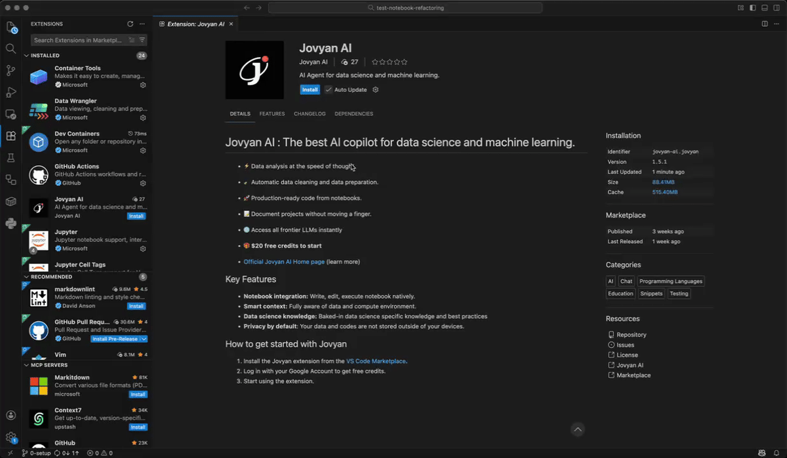

# Install Jovyan AI

Jovyan AI is an extension that can be installed in most popular IDEs.
Install using one of these methods:

* **Deep link inside IDE** - fastest method
* **Marketplace search** - for non-listed IDEs

## Install from IDE with deep link
1. Click on the link corresponding to your IDE. This will open the Jovyan extension inside your favorite IDE.
* <a href="vscode:extension/jovyan-ai.jovyan">VS Code</a>
* <a href="vscode-insiders:extension/jovyan-ai.jovyan">VS Code Insiders</a>
* <a href="cursor:extension/jovyan-ai.jovyan">Cursor</a>
* <a href="windsurf:extension/jovyan-ai.jovyan">Windsurf</a>
* <a href="positron:extension/jovyan-ai.jovyan">Positron</a>

2. Simply click on "Install" and you are set!
After installation, find the Jovyan AI icon in the Side Bar or press `Ctrl+Shift+A` (Windows/linux) or `Cmd+Shift+A` to open the Jovyan AI panel.

## Install on code-server (Browser-Based VS Code)

Jovyan AI works in [code-server](https://github.com/coder/code-server) and other browser-based VS Code environments. Because these environments run in a browser, the sign-in flow uses a device authorization method instead of deep links.

1. Install the extension from the marketplace within code-server (search "Jovyan")
2. When you click **"Try Jovyan AI for Free"** or **"Log in"**, a browser tab opens for authentication
3. Sign in on the website, then return to code-server — it detects the login automatically (no manual action needed)

See [Create Your Account](/quick-start/create-account#code-server--browser-based-environments) for details on the authentication flow.

## Install from Marketplace
Alternatively, for other IDEs that are forks of Code OSS, you can:

1. Open your IDE
2. Access Extensions: Click the Extensions icon in the Side Bar or press `Ctrl+Shift+X` (Windows/Linux) or `Cmd+Shift+X` (macOS)
3. Search for "Jovyan"
4. Select "Jovyan AI" by jovyan-ai and click **Install**
5. Reload the extensions if prompted

> **Pro Tip:**
> By default, Jovyan AI will appear in the **left side bar** of your IDE once installed.
> If you prefer, you can **click and drag the Jovyan AI icon** to move it to the right side bar or dock it anywhere in your IDE—customize your workspace to fit your workflow!
>
> 

**Next step:** Your extension is installed! Click "Next" to set up your account in less than a minute.
