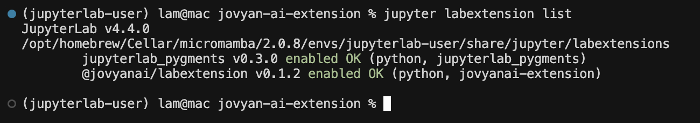

# Getting Started with Jovyan AI

Welcome to the Jovyan AI setup guide. This document provides instructions for setting up and using Jovyan AI within your JupyterLab environment.

## Installing the Jupyter Extension

First, ensure you have JupyterLab version 4.x or later installed. Then, install the Jovyan AI extension in your JupyterLab environment using pip:

```bash
pip install --upgrade jovyanai-extension
```

After installation, verify that the extension is installed correctly by running the following command in your terminal:
```bash
jupyter labextension list
```

You should see `@jovyanai/labextension` listed among the installed extensions, similar to this:



## Obtain an User Token
### Create an account
If you don't have an account at [Jovyan AI website](https://jovyan-ai.com/), please click on "Get Started" and join the waitlist. We are working hard to expand the availability as soon as possible.

### Sign in to your account
Next, signin to your account at the [Jovyan AI website](https://jovyan-ai.com/account).  
You will get redirected automatically from your invitation email or you can sign in from the Homepage.

### Generate a token
On your Account page, which should look similar to the image below, click "Generate new token" and securely store the generated token. You will only see the token once.


## Authenticate the Extension
The Jovyan AI extension requires the user token to communicate with backend services. To authenticate:
1.  In the JupyterLab menu bar, navigate to Settings -> Settings Editor.
2.  In the search bar within the Settings Editor, type "jovyan".
3.  Paste the user token you obtained earlier into the "Authentication Token" field.


You are now ready to use Jovyan AI. Open a new notebook and begin exploring its features. For a detailed overview of the functionalities, please check the Features section.


## Get help
If you need any assistance, please drop into our Discord server https://discord.gg/55hAPE6P and give us a ping.

