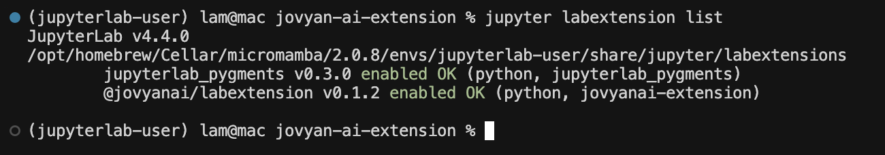

# Installing in local JupyterLab

First, ensure you have JupyterLab version 4.x or later installed. Then, install the Jovyan AI extension in your JupyterLab environment using pip:

```bash
pip install --upgrade jovyanai-extension
```

After installation, verify that the extension is installed correctly by running the following command in your terminal:
```bash
jupyter labextension list
```

You should see `@jovyanai/labextension` listed among the installed extensions, similar to this:



## Authenticate the Extension
The Jovyan AI extension requires the user token to communicate with backend services. To authenticate:
1.  In the JupyterLab menu bar, navigate to Settings -> Settings Editor.
2.  In the search bar within the Settings Editor, type "jovyan".
3.  Paste the user token you obtained earlier into the "Authentication Token" field.
