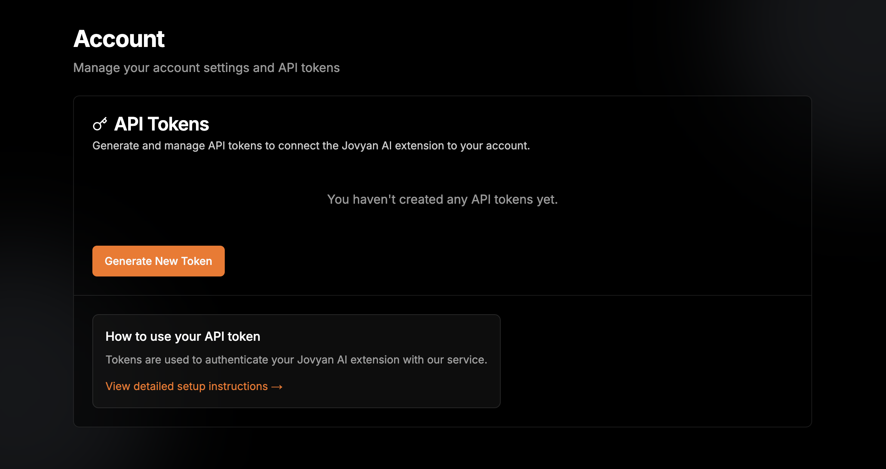

# Logging in

Jovyan AI requires a token to secure your access backend service.

## Obtain an User Token
### Create an account or login
Next, signin or create an account at the [Jovyan AI website](https://jovyan-ai.com/auth/login).  
You will receive and email with login link which redirect to your account page.

### Generate a token
On your Account page, which should look similar to the image below, click "Generate new token" and securely store the generated token. You will only see the token once.

## Use the token
You are now ready to use Jovyan AI. The token can be provided by changing the settings in JupyterLab, or via a dialog when you use Jovyan AI, or via an environment variable.

## Get help
If you need any assistance, please drop into our Discord server https://discord.gg/Au3sB5KftU and give us a ping.

